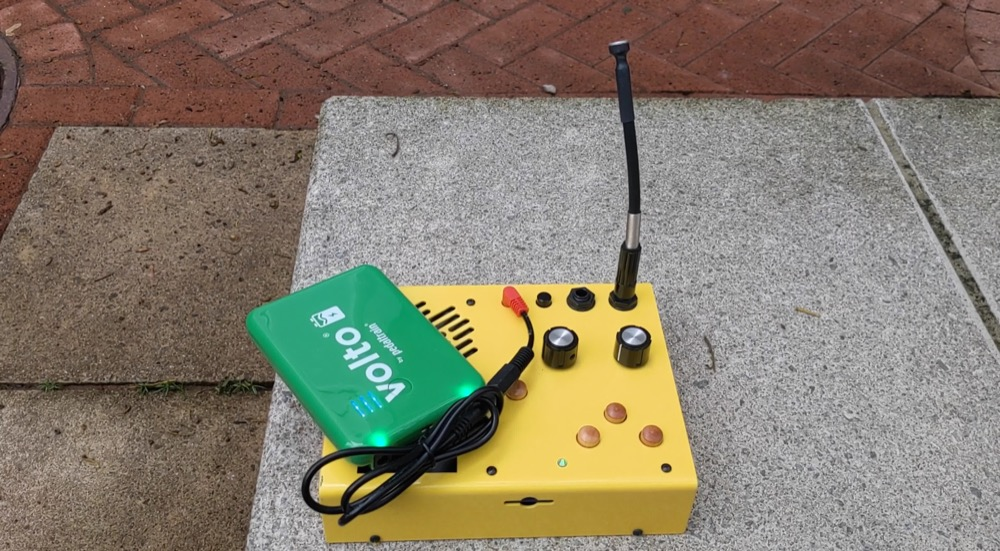

# clase-06

viernes 22 de septiembre 2022, presencial

esta clase veremos los conceptos de grabar, samplear y buffers

la clase pasada vimos:

- percepción de alturas y notas musicales
- notación musical
- mensajes de notas MIDI
- mensajes de control MIDI

esta clase veremos intro a teoría musical occidental Y MIDI:

- diferencia entre variables y arreglos
- estrategias de arreglos
- implementaciones en ChucK
- implementaciones en Pure Data

## grabar

grabar será tomar un sonido, obtener números a partir de ese sonido, y esos números ordenarlos y guardarlos en un archivo, lo que nos permitirá usarlo posteriormente.

por ejemplo, podemos usar ChucK y Pure Data para no solamente emitir el sonido que estamos creando a nuestros parlantes, sino que podemos crear un espacio en la memoria de nuestro computador y luego almacenar ese resultado en un archivo que podemos copiar, almacenar y reproducir.

antecedentes históricos de grabar sonido, hace 100 años.

## samplear

por samplear, del inglés "sample" que significa muestra, se entiende tomar un sonido que ya existe.

es la base del hip hop.

ya no es necesario hacer un gesto para mover cuerdas, sino que usamos sonido preexistente como la base de nuestro sonido.

los instrumentos que nos permiten grabar sonido, manipularlo y luego reproducirlo reciben el nombre de samplers.

el instrumento que permitió esta revolución es el Akai MPC diseñado por Roger Linn.

mostrar ejemplo de J Dilla, The Avalanches, Paul's Boutique.

## buffers

en la estructura de un computador tenemos nuestro disco duro donde tenemos archivos.

nuestros programas en ChucK, Pure Data, o similares, nos permiten crear pequeños espacios en memoria que solamente existen mientras el programa está operando, y donde podemos almacenar información.

esa información pueden ser números que calculamos, como una variable, o dibujos que hacemos en la pantalla con nuestra gestualidad capturada por sensores, o puede ser un archivo de audio que vive en nuestro disco duro.

cuando lo cargamos en un buffer, podemos copiarlo, reproducirlo a distintas velocidades, invertirlo, incluso destruirlo, y todo esto sin pasar a llevar nuestro archivo original.

## consideraciones estéticas y técnicas

cuando pasamos de audio analógico a audio digital, ocurren todos estos pasos

- el micrófono influye
- tenemos que decidir la frecuencia de muestreo, que influye en cuánta información almacenamos.
- tenemos que decidir la resolución, que influye en si el sonido va a ser distorsionado o de alta fidelidad.

## instrumentos de inspiración: Critter & Guitari Kaleidoloop

este instrumento tiene las siguientes características:

- entradas y salidas
  - 1 entrada con cable 1/4" TS mono, o un micrófono condensador incluido
  - 1 salida con cable 1/4" TS mono, o el parlante incorporado.
- almacenamiento
  - 1 tarjeta SD para escribir y leer audio.
- interfaz de usuario
  - 1 perilla de volumen
  - 1 perilla de velocidad de reproducción
  - 1 botón para alternar entre grabar o reproducir
  - 1 botón para alternar entre modo continuo o escalonado de frecuencia
  - 2 botones para navegar samples, adelante y atrás

más info:
- https://www.youtube.com/watch?v=nt6CW3oEItk

## instrumentos de inspiración: Akai MPC 2000

fuente: https://nmaahc.si.edu/object/nmaahc_2014.139.1

J Dilla - Don't Cry https://www.youtube.com/watch?v=hXeywtmWKzU

The XX - Intro https://www.youtube.com/watch?v=9f__FGEfQ14

## instrumentos de inspiración: Korg Volca Sample

Korg Volca Sample https://www.youtube.com/watch?v=THImd641WXk

https://www.tatsuyatakahashi.com/2014-korg-volca-sample

## instrumentos de inspiración: BASTL microgranny

BASTL microgranny

https://bastl-instruments.com/instruments/microgranny/

## instrumentos de inspiración: Ciat-Lonbarde Cocoquantus

Hainback Ciat-Lonbarde Cocoquantus - Playing and Patching Techniques
https://www.youtube.com/watch?v=z0KoI95DfZU

PanicGirlVids - The Cocoquantus by Ciat-Lonbarde - Basic Patch From Scratch
https://www.youtube.com/watch?v=lQAHxeVrEqM

## implementación en ChucK

## implementación en Pure Data
