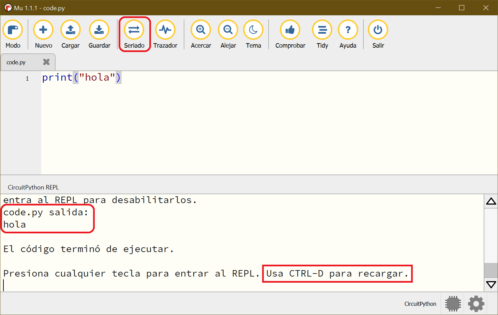

# clase-10

## tarjetas de desarrollo

las tarjetas de desarrollo son pequeños circuitos que pueden ser programados para correr funciones específicas.

la tarjeta de desarrollo más popular hasta ahora es el Arduino UNO, al ser el primer proyecto _open hardware_ orientado a principiantes.

actualmente existen una infinidad de tarjetas de desarrollo en el mercado, cada una con sus ventajas y desventajas.

en nuestro curso utilizaremos la tarjeta _circuit playground_ desarrollada por la empresa Adafruit, ya que integra una gran cantidad de sensores, un micrófono y un pequeño parlante.

|              Circuit Playground Bluefruit               |              Circuit Playground Express               |
| :-----------------------------------------------------: | :---------------------------------------------------: |
|  |  |

características generales:

- entradas:

  - 7x sensores de contacto (A1-A7)
  - 1x sensor de movimiento y orientación
  - 1x sensor de temperatura
  - 1x sensor de luz
  - 1x sensor de sonido básico
  - 2x pulsadores (Botones A y B)
  - 1x interruptor deslizante
  - 1x botón de RESET

- Salidas:

  - 10x mini NeoPixels (LEDs RGB)
  - 1x mini parlante
  - 1x LED verde de encendido (ON)
  - 1x LED rojo de uso genereal (D13)
  - 1x puerto USB para programación y debugging

- el puerto USB puede actuar como:

  - puerto serial (para enviar o recibir mensajes)
  - teclado, mouse, o joystick
  - interfaz MIDI

- 8 x pines digitales de entrada o salida (encendidos o apagados)

aprenderemos a utilizar los abundantes recursos que la placa _circuit playground_ pone a nuestra disposición, y a combinarlos para diseñar instrumentos musicales digitales.

estas placas son compatibles con _CircuitPython_, que facilita en gran parte su uso.

recursos:

- [Sitio oficial Adafruit](https://www.adafruit.com 'Adafruit')
- [Documentación oficial Circuit Playground Express](https://learn.adafruit.com/adafruit-circuit-playground-express 'Circuit Playground Express')
- [Documentación oficial Circuit Playground Bluefruit](https://learn.adafruit.com/adafruit-circuit-playground-bluefruit 'Circuit Playground Bluefruit')
- [El primer "bug"](https://en.wikipedia.org/wiki/Software_bug 'El primer "bug"')

## CircuitPython

CircuitPython es un lenguaje de programación _open source_ diseñado específicamente para programar microcontroladores (computadores pequeños).

es una versión más acotada del lenguaje de programación Python.

contiene un conjunto de bibliotecas que permiten programar más de 300 placas de desarrollo. este número sigue creciendo.

recursos:

- [Web oficial de CircuitPython](https://circuitpython.org/ 'CircuitPython')
- [Placas de desarrollo soportadas](https://circuitpython.org/downloads 'Placas')
- [Introducción a CircuitPython por Adafruit](https://learn.adafruit.com/welcome-to-circuitpython/what-is-circuitpython 'Introducción a CircuitPython')

## Mu Editor

CircuitPython permite escribir código en cualquier editor de texto.

para hacerlo más amigable, en este curso usaremos el software _Mu Editor_ para escribir nuestros programas.


recursos:

- [Descarga Mu Editor](https://codewith.mu/ 'Descarga Mu Editor')

## conectando nuestra placa por primera vez

para empezar, es necesario instalar CircuitPython en tu placa.

sigue los siguientes pasos:

1. descarga CircuitPython para tu placa:
   - [CircuitPython para Circuit Playground Bluefruit](https://circuitpython.org/board/circuitplayground_bluefruit/ 'descarga')
   - [CircuitPython para Circuit Playground Express](https://circuitpython.org/board/circuitplayground_express/ 'descarga')
2. Conecta la placa por USB a tu computador.
3. presiona el botón RESET que se encuentra al medio de la placa. Prueba presionando una vez, o dos veces seguidas.
4. si todo sale bien, los LEDs se encenderán en color verde y en tu computador aparecerá un disco extraible llamado `CPLAYBOOT`, como si hubieras conectado un pendrive.


5. copia el archivo que descargaste dentro de `CPLAYBOOT`.
6. en este momento CircuitPython se instalará automáticamente, `CPLAYBOOT` desaparecerá y se conectará un nuevo disco extraible llamado `CIRCUITPI`.


7. ahora abre Mu editor, la primera vez suele demorar unos 2 minutos en abrir.
8. si te pregunta, elige CircuitPython y debería reconocer automáticamente tu placa.
9. escribe `print("hola")` y guarda el archivo como `code.py` dentro de `CIRCUITPI`.
10. si todo está bien, al presionar el botón "Seriado" se debería desplegar el mensaje "hola". rste mensaje lo envía la placa por el cable USB y se nos muestra en el computador.
11. si quieres volver a correr el código, presiona `CTRL + D`.



## introducción a programar en CircuitPython

en Python tenemos 3 entidades principales:

- variables
- funciones
- objetos

explicaremos sus características y empezaremos a programar inmediatamente.

### variables

;as variables son _cajoncitos de memoria_ donde se puede escribir información para luego ser leída o reescrita. como pueden ser reescritas, se llaman variables.

una variable puede ser un número, un texto, o estructuras de datos más complejos.

> nota: los nombres de las variables no pueden contener espacios, ni tampoco comenzar con un número.

```python
# ejemplo 01: definiendo variables
x = 5
y = "John"
mi_variable = 4.5

print(x)
print(y)
print(mi_variable)
```

```python
# ejemplo 2: sumando números
x = 5
y = 4.5
z = x + y
print(z)
```

```python
# ejemplo 3: concatenando texto
x = "Juan"
y = "González"
z = x + " " + y
print(z)
```

### funciones

las funciones nos permiten correr acciones.

Python nos ofrece muchas funciones listas para usar. En los ejemplos anteriores ya usamos la función `print()` que permite mostrar datos en la consola.

tú también puedes crear tus propias funciones.

```python
# ejemplo 4: usando la función str() para convertir números a texto
x = "Temperatura: "
y = 27.2
z = str(y)

msg = x + z + "°C"
print(msg)
```

```python
# ejemplo 5: definiendo nuestra propia función y usándola
def imprimeTemperatura(temp):
    msg = "Temperatura: " + str(temp) + "°C"
    print(msg)

imprimeTemperatura(27.2)
imprimeTemperatura(26.9)
imprimeTemperatura(26.3)
```

### objetos

los objetos nos permiten agrupar variables y funciones para darles un sentido lógico.

solo como ejemplo, Python podría tener un objeto llamado `perro` que contiene las características y acciones que pueden hacer los perros.

el operador `.` permite interactuar con los objetos en Python.

`perro.nombre` o `perro.edad` me permite acceder al nombre y la edad de mi perro. Si quisiera hacer que mi perro ladre, puedo escribir `perro.ladra()`.

MicroPython y Adafruit nos proveen una biblioteca de objetos que nos permiten interactuar con los componentes de nuestra placa de desarrollo.

en los siguientes ejemplos se muestra como encender o apagar un LED utilizando el objeto `cp` incluido en la biblioteca `adafruit_circuitplayground`.

```python
# ejemplo 7: encendiendo el LED de la placa

# importa biblioteca de Adafruit CircuitPlayground
from adafruit_circuitplayground import cp

while True:
    cp.red_led = True
```

```python
# ejemplo 8: apagando el LED de la placa
from adafruit_circuitplayground import cp

while True:
    cp.red_led = False
```

### haciendo que nuestro programa corra por siempre

hasta ahora todos nuestros programas han corrido una sola vez. es decir, la placa ha leído línea por línea de arriba hacia abajo, corriendo las instrucciones y luego deteniéndose.

si queremos que nuestro programa corra por un tiempo indefinido podemos usar un pequeño truco: definir un bloque de código usando la notación `while True:`

```python
# ejemplo 9: usando "while True" para que nuestro programa no se detenga
x = 0
while True:
    x = x + 1
    print("corrida número:", x)
```

notarás que estos códigos corren indefinidamente y muy rápido, haciendo que Mu Editor colapse. Necesitamos una forma para controlar los tiempos de corrida de nuestro código.

### haciendo que nuestro programa tome descansos

existen técnicas para controlar los tiempos de corrida de nuestro código, una de las más simples es usar el objeto `time` y su función `sleep(segundos)`, que permite correr pausas en nuestro programa.

```python
# ejemplo 10: agregando pausas en nuestro programa
import time # importar biblioteca para tiempo

while True:
    print("Hola!")
    # dormimos 1.0 segundo (no se hace nada)
    time.sleep(1.0)
```

```python
# ejemplo 11: agregando pausas en nuestro programa
import time
x = 0

while True:
    x = x + 1
    print("Ejecución número:", x)
    # dormimos medio segundo
    time.sleep(0.5)
```

## prueba clásica: encendiendo y apagando un LED

ya hemos revisado los conceptos básicos que nos permitirán crear nuestros primeros programas.

usualmente, la prueba más simple para probar que nuestro circuito está programándose correctamente consiste en encender y apagar un LED de forma indefinida.

¿cómo podrías escribir un programa que encienda un LED durante 1 segundo y luego lo apague durante 1 segundo, y que esto suceda indefinidamente?

todo lo que se necesita lo hemos visto en las secciones anteriores.

```python
# ejemplo 12: encendiendo y apagando un LED
from adafruit_circuitplayground import cp
import time

while True:
    # prende LED rojo
    cp.red_led = True
    # espera 1.0 segundos
    time.sleep(1.0)

    # apaga LED rojo
    cp.red_led = False
    # espera 1.0 segundos
    time.sleep(1.0)
```

### ejercicios para practicar:

1. modificar el tiempo de parpadeo, hacerlo más rápido o más lento.
2. hacer que el tiempo de encendido sea más largo que el tiempo de apagado.
3. hacer que el tiempo de encendido sea más corto que el tiempo de apagado.
4. ¿Cuál es el tiempo de parpadeo más rápido que puedes correr? ¿Qué pasa si el tiempo de parpadeo es demasiado rápido?
5. hacer que el LED parpadee 3 veces muy rápido y luego se apague 1 segundo.
6. hacer que el LED parpadee 3 veces, luego 2 veces, luego 1 vez, con una pausa de tres segundos entre cada una de ellas.
7. utiliza una variable para que el tiempo de encendido y apagado sean iguales y puedas cambiarlo fácilmente modificando una sola línea de código.
8. crea una función llamada `LED_ON(n)` que te permita encender el LED durante "n" segundos, y otra llamada `LED_OFF(n)` que permita apagar el LED durante "n" segundos.
9. utiliza las funciones recién creadas para generar el parpadeo.

## LEDs RGB (NeoPixel)

```python
# ejemplo 13: Usando los LEDs RGB
from adafruit_circuitplayground import cp
import time

# Colores
RED = (255, 0, 0)
YELLOW = (255, 150, 0)
GREEN = (0, 255, 0)
CYAN = (0, 255, 255)
BLUE = (0, 0, 255)
PURPLE = (180, 0, 255)
WHITE = (255, 255, 255)
OFF = (0, 0, 0)

while True:

    # Configura el brillo de los LEDs (entre 0 y 1)
    cp.pixels.brightness = 0.3

    # Pintamos todos los LEDs de un mismo color
    cp.pixels.fill(YELLOW)
    time.sleep(0.5)
    cp.pixels.fill(RED)
    time.sleep(0.5)
    cp.pixels.fill(GREEN)
    time.sleep(0.5)
    cp.pixels.fill(CYAN)
    time.sleep(0.5)
    cp.pixels.fill(BLUE)
    time.sleep(0.5)
    cp.pixels.fill(PURPLE)
    time.sleep(0.5)
    cp.pixels.fill(WHITE)

    time.sleep(1)

    # Pintamos cada LED con un color distinto
    cp.pixels[0] = RED
    cp.pixels[1] = YELLOW
    cp.pixels[2] = GREEN
    cp.pixels[3] = CYAN
    cp.pixels[4] = BLUE
    cp.pixels[5] = PURPLE
    cp.pixels[6] = WHITE

    time.sleep(1)

    # Apagamos los LEDs
    cp.pixels.fill(OFF)

    time.sleep(1)

```
