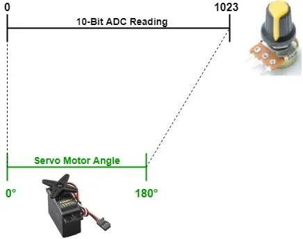
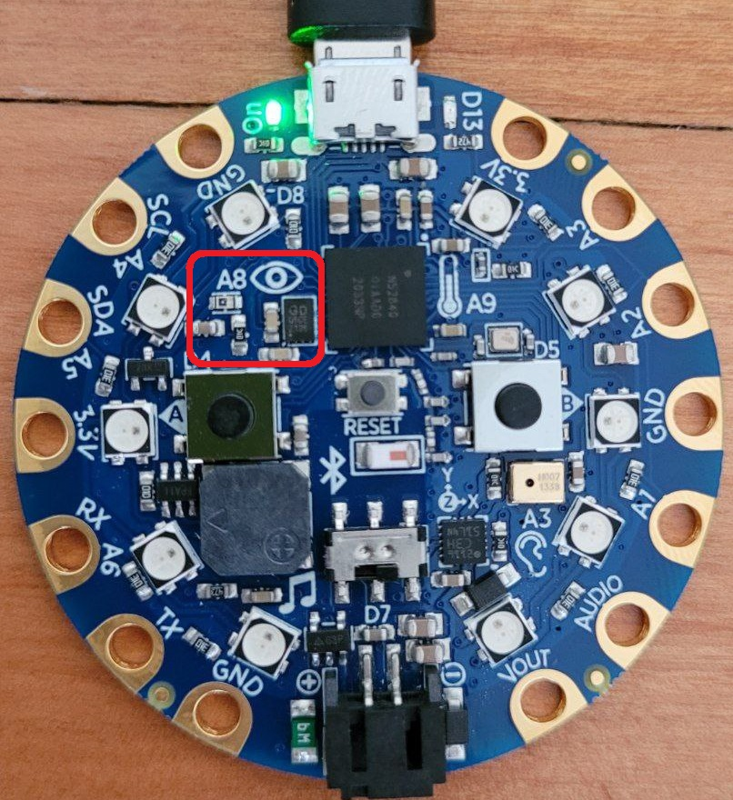
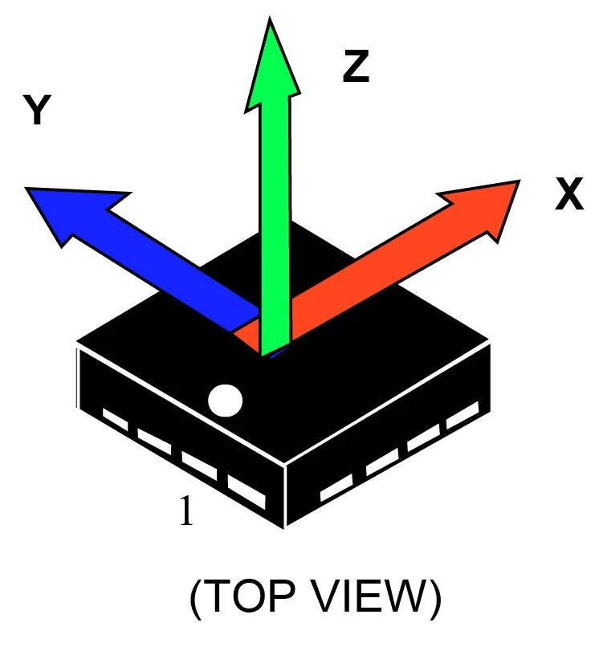
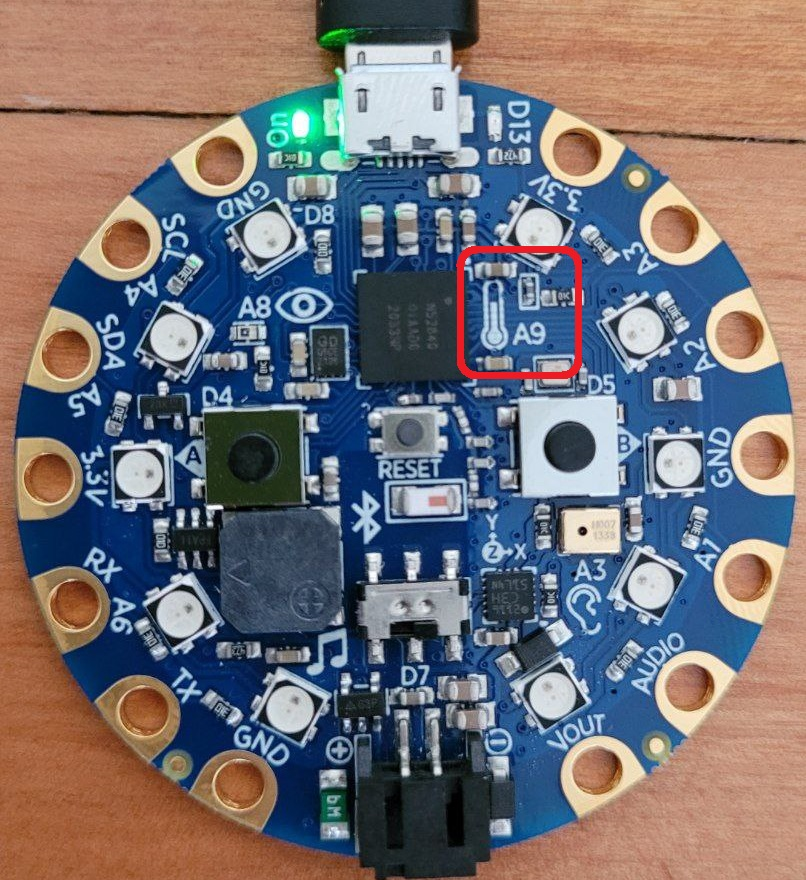

# clase-11

## introducción a los sensores

los sensores nos permiten obtener mediciones de algún fenómeno que nos interese, por ejemplo:

- el estado de un botón (presionado o soltado)
- la posición de una perilla/potenciómetro
- la amplitud o frecuencia de alguna fuente de sonido
- la velocidad del viento
- la temperatura del agua
- la luminosidad de una fuente de luz

los sensores permiten obtener información del mundo real, que es análogo, y transformarla a información digital que podemos almacenar en nuestro microcontrolador.

con esta información de los sensores, podemos reaccionar con modos tan simples como imprimir en consola, o generar respuestas en forma de sonido, luz, movimiento, etc.

## densidad de información

al tratar de medir el mundo real, las personas han generado escalas numéricas para representar sus datos. por ejemplo, la escala de decibelios para medir el sonido, o la de grados Celsius para medir temperatura.

imaginemos un termómetro que es capaz de medir cambios de temperatura de 0.1°C y otro que puede detectar cambios de 0.01°C. ¿con cuál de estos termómetros obtendremos más información?

mientras más preciso es nuestro sensor, la escala numérica se hace más "densa", pudiendo medir más información.

## transformando información análoga a digital

en la actualidad, gran parte de los sensores que usamos están conectados a sistemas digitales (computadores, microcontroladores), por lo que debemos tomar su información del mundo real análogo y procesarla para digitalizarla y poder usarla en un sistema digital.

para lograr esto es necesario llevar a cabo un proceso llamado _"conversión análogo digital"_ que fundamentalmente lo que hace es tomar un número con infinitos decimales y transformarlo a un número aproximado con una resolución de _n_ bits que los computadores pueden entender.

mientras más bits, la escala será más densa y la información será más fiel a la realidad.

<p float="left" align="middle">
<a href="https://www.arrow.com/en/research-and-events/articles/engineering-resource-basics-of-analog-to-digital-converters"></a>
<a href="https://www.exploreembedded.com/wiki/ADC_Using_PIC16F877A"></a>
</p>

## sensores en Adafruit Circuit Playground

como vimos la semana pasada, la tarjeta de desarrollo Adafruit Circuit Playground integra varios sensores que podemos utilizar inmediatamente:

- 2x pulsadores (botones A y B)
- 7x sensores de contacto (A1-A7)
- 1x sensor de movimiento y orientación
- 1x sensor de temperatura
- 1x sensor de luz
- 1x sensor de sonido básico

además los pines A1-A7 están conectados a un conversor análogo-digital, por lo que se pueden utilizar para medir un voltaje analógico entre 0 volts y 3.3 volts.

## leyendo los botones pulsadores

<p float="left" align="middle">

</p>

los botones A y B solo pueden tener dos estados: presionados o soltados.

para nuestra placa esto se representa con un bit que puede tener el estado `0` (`False`) o `1` (`True`).

para consultar el estado de cada botón solo debemos importar el objeto `cp` y acceder a las propiedades `cp.button_a` y `cp.button_b`.

si queremos que corra alguna acción cuando alguno de los botones esté en el estado `True`, usaremos un bloque `if` de Python.

los bloques `if` se utilizan para tomar decisiones en base a una pregunta lógica.

ejemplos de preguntas lógicas:

- `if x >= 10:`: si x es mayor o igual a 10
- `if y < 0:`: si y es menor estricto que 0
- `if z == 25: `: si z es idéntico a 25
- `if cp.button_a == True: `: si el botón A está presionado
- `if cp.button_a == False: ` si el botón A está soltado
- `if cp.button_a != True: `: si el botón A no está presionado

```python
# ejemplo 01: leyendo botones pulsadores con bloque if
# importar biblioteca
from adafruit_circuitplayground import cp

ROJO = (255, 0, 0)
AZUL = (0, 0, 255)

# ajustar brillo
cp.pixels.brightness = 0.1

# bucle infinito
while True:
    # si el boton A esta presionado
    if cp.button_a == True:
        # pixeles color rojo
        cp.pixels.fill(ROJO)

    # si el boton B esta presionado
    if cp.button_b == True:
        # pixeles color azul
        cp.pixels.fill(AZUL)
```

## leyendo botones para hacer sonidos

en el siguiente ejemplo utilizaremos el parlante usando las funciones `cp.start_tone(freq)` y `cp.stop_tone()`.

<p float="left" align="middle">

</p>

la función `cp.start_tone(freq)` necesita la frecuencia del sonido que deseamos reproducir.

antes de cambiar la frecuencia siempre es necesario correr la instrucción `cp.stop_tone()`.

una alternativa es usar la función `cp.play_tone(freq, duration)` para reproducir un tono por una duración determinada en segundos.

```python
# ejemplo 02: usando botones y parlante con bloque if, elif y else.
# importar biblioteca
from adafruit_circuitplayground import cp

# bucle infinito
while True:
    # si el boton A esta presionado
    if cp.button_a == True:
        # emitir sonido con frecuencia 300 Hz
        cp.start_tone(300)
    # o si el boton B esta presionado
    elif cp.button_b == True:
        # emitir sonido con frecuencia 600 Hz
        cp.start_tone(600)
    # o en otro caso
    else:
        # detener sonido
        cp.stop_tone()
```

el bloque `if` se puede acompañar con bloques `elif` y/o un bloque `else`.

el bloque `elif` permite correr una nueva pregunta lógica si es que la anterior no resultó verdadera. puedes usar varios bloques `elif` sucesivos.

el bloque `else` corre solamente si ninguna de las preguntas lógicas anteriores resultó verdadera.

la primera de las preguntas if/elif/else que sea válida, hace que el código deje de revisar las siguientes preguntas sucesivas, y corra las siguientes líneas de código.

## reproduciendo archivos de audio

nuestra placa es capaz de reproducir sonidos más complejos.

como los recursos de memoria y de velocidad son limitados, los archivos de audio deben seguir algunas reglas específicas.

- archivos .wav
- 16 bits de resolución
- frecuencia de muestreo menor o igual a 22050 hertz
- monofónicos (no stereo)

Adafruit tiene una guía para poder convertir tus archivos de audio a este formato en este enlace: https://learn.adafruit.com/adafruit-wave-shield-audio-shield-for-arduino/convert-files

por ahora haremos un ejemplo con 2 audios ya adaptados, descárgalos y súbelos a tu placa:

- [laugh.wav](https://cdn-learn.adafruit.com/assets/assets/000/047/232/original/laugh.wav?1507858014 'laugh.wav')
- [rimshot.wav](https://cdn-learn.adafruit.com/assets/assets/000/047/231/original/rimshot.wav?1507858005 'rimshot.wav')

usaremos la función `cp.play_file(filename)` para reproducirlos.

```python
# ejemplo 03: reproduciendo archivos .wav
# importar biblioteca
from adafruit_circuitplayground import cp

# bucle infinito
while True:
    # si el boton A esta presionado
    if cp.button_a:
        cp.play_file("rimshot.wav")
    # si el boton B esta presionado
    if cp.button_b:
        cp.play_file("laugh.wav")
```

notamos que:

- si presionamos alguno de los botones, el sonido correspondiente ocurre, y aunque soltemos el botón, el sonido llega hasta el final.
- podemos mantener presionado algún botón, y si lo hacemos hasta que el sonido termine, el sonido se repite.
- si un sonido está ocurriendo, no podemos interrumpirlo, ni presionando el mismo botón ni el otro.

## sensores de contacto capacitivos (_touch_)

<p float="left" align="middle">

</p>

las entradas A1 a A7 pueden ser utilizados como sensores capacitivos _touch_, como los presentes en las pantallas de dispositivos móviles.

cuando usamos estos sensores, debemos usar la función `cp.adjust_touch_threshold(100)` para calibrar y ajustar la sensibilidad de los botones _touch_.

podemos llamar a las funciones `cp.touch_A1 ... cp.touch_A7` para acceder al estado de cada botón, que pueden tener solamente 2 estados posibles: `True` o `False`.

```python
# ejemplo 04: usando botones capacitivos y parlante
# importar biblioteca
from adafruit_circuitplayground import cp

# ajustar sensibilidad
# numeros menores hacen que sea más sensible
cp.adjust_touch_threshold(100)

# definir frecuencia base
f_base = 400
# definir aumento entre frecuencias
f_delta = 100;

# crear lista vacia
frecuencias = []

# iterar contador i entre 0 y 6
for i in range(0, 7):
    # agregar un nuevo valor a la lista
    frecuencias.append(f_base + f_delta * i)

# bucle infinito
while True:

    # variable para almacenar numero boton presionado
    # valor inicial es -1
    botonPresionado = -1

    # si alguno de los botones es presionado
    # actualizar el valor de la variable
    if cp.touch_A1 == True:
        botonPresionado = 1;
    elif cp.touch_A2 == True:
        botonPresionado = 2;
    elif cp.touch_A3 == True:
        botonPresionado = 3;
    elif cp.touch_A4 == True:
        botonPresionado = 4;
    elif cp.touch_A5 == True:
        botonPresionado = 5;
    elif cp.touch_A6 == True:
        botonPresionado = 6;
    elif cp.touch_A7 == True:
        botonPresionado = 7;

    # si algun boton fue presionado
    if botonPresionado > 0:
        print(frecuencias[botonPresionado - 1])
        # hacer sonar la frecuencia correspondiente
        # nota: los botones son rango 1-7
        # pero arreglo es 0-6, asi que restamos 1
        cp.start_tone(frecuencias[botonPresionado - 1])
    # si ningun boton fue presionado
    else:
        # apagar
        cp.stop_tone()
```

## agregando potenciómetros

un elemento clásico en los instrumentos electrónicos son las perillas, que permiten ajustar distintos parámetros musicales.

electrónicamente las perillas son potenciómetros (resistencias variables), que actuan como un sensor ya que informan a nuestro mini computador su estado o posición a través de un voltaje.

<p float="left" align="middle">


</p>

los potenciómetros poseen 3 terminales:

- uno de los extremos lo conectamos a 0 volts (tierra o GND por el inglés "ground")
- el otro extremo se conecta al voltaje máximo del sistema, en nuestro caso 3.3 volts
- el terminal central tendrá un voltaje variable entre 0V y 3.3V, dependiendo de la posición de la perilla.

<p float="left" align="middle">

</p>

nuestra tarjeta de desarrollo puede leer ese voltaje ya que posee un conversor análogo-digital conectado en los pines A0-A7.

```python
# ejemplo 05: Leyendo posición de perilla
# importar bibliotecas
import board
import analogio
import time

# conectar terminal central del potenciometro a A3
potenciometro = analogio.AnalogIn(board.A3)

while True:

    # leer valor con resolucion 16 bits, en rango 0 a 65535
    valorCrudo = potenciometro.value

    # dividir por 256 para bajar rango 0 a 255
    # usamos // para lograr un valor entero
    valorProcesado = valorCrudo // 256

    # imprimir en consola
    print(valorProcesado)

    # o imprimir en Mu Editor
    # tenemos que convertir el valor a tupla
    # para eso lo encerramos en paréntesis y le agregamos una coma
    # print((valorProcesado,))

    # dormir 0.1 segundos
    time.sleep(0.1)
```

<p float="left" align="middle">

</p>

```python
# ejemplo 06: controlando frecuencia de sonido con perilla
import board
import analogio
import time

pot = analogio.AnalogIn(board.A3) # potenciómetro conectado a pin A3

# función para convertir escala a1-a2 a escala b1-b2
def map_range(s, a1, a2, b1, b2):
    return  b1 + ((s - a1) * (b2 - b1) / (a2 - a1))

while True:
    pos = pot.value  # valor de 0 a 65535
    # convierte rango de 0 a 65535 al rago de 300 a 500
    freq = map_range(pos, 0, 65535, 300, 500)
    cp.play_tone(freq, 0.2)
```

## sensor de luz

<p float="left" align="middle">

</p>

nuestra placa de desarrollo integra una fotoresistencia

las fotoresistencias son dispositivos que cambian su resistencia eléctrica según la cantidad de luz que está recibiendo.

esto permite usarlo como un sensor de luz.

para consultar su valor solo es necesario escribir `cp.light`

```python
# ejemplo 00: sensor de luz

from adafruit_circuitplayground import cp
import time

while True:
    luz = cp.light
    #luz = (cp.light,)  # Para graficar en Mu Editor
    print(luz)
    time.sleep(0.01)
```

podemos observar que nos entrega valores entre 0 (sin luz), y 310 (máxima luz).

en el siguiente ejemplo se usa el valor de luz sensado para controlar la frecuencia de salida de nuestro parlante.

```python
# ejemplo 00: sensor de luz controlando la frecuencia del parlante
from adafruit_circuitplayground import cp

# función para convertir escala a1-a2 a escala b1-b2
def map_range(s, a1, a2, b1, b2):
    return  b1 + ((s - a1) * (b2 - b1) / (a2 - a1))

while True:
    luz = cp.light
    freq = map_range(luz, 0, 300, 200, 1000)
    cp.play_tone(freq, 0.2)
```

## sensor de posición y aceleración

<p float="left" align="middle">

<a href="https://www.allaboutcircuits.com/news/high-stability-low-noise-3-axis-digital-accelerometer-STMicroelectronics/"></a>
</p>

el acelerómetro es un chip especializado que tiene la capacidad de sensar la aceleración a la que está siendo sometido, incluída la aceleración de gravedad de la tierra.

el acelerómetro posee 3 ejes, lo que permite deducir la orientación del sensor en el espacio tridimensional.

en el siguiente ejemplo graficaremos eje por eje para ver qué rangos de datos nos entrega.

```python
# ejemplo 00: graficando datos del acelerómetro
import time
from adafruit_circuitplayground import cp

while True:
    x, y, z = cp.acceleration
    print((0, 0, z))    # eje Z
    #print((0, y, 0))   # eje y
    #print((x, 0, 0))   # eje x
    #print((x, y, z))   # los 3 ejes

    time.sleep(0.1)
```

si graficamos eje por eje nos damos cuenta que en reposo, los ejes nos indican un rango entre +9.8 y -9.8, que corresponde aproximadamente a la aceleración de gravedad de la tierra.

podemos usar esto para controlar la frecuencia de nuestro parlante usando la gravedad de la tierra.

```python
# ejemplo 00: aceleración de gravedad controlando la frecuencia del parlante
from adafruit_circuitplayground import cp

# función para convertir escala a1-a2 a escala b1-b2
def map_range(s, a1, a2, b1, b2):
    return  b1 + ((s - a1) * (b2 - b1) / (a2 - a1))

while True:
    x, y, z = cp.acceleration
    print((0, 0, z)) 

    freq = map_range(z, -9.8, 9.8, 1200, 200)
    cp.play_tone(freq, 0.2)
```

la bibliteca de circuit playground integra una forma muy simple para detectar sacudidas usando la función `cp.shake()`.

podemos controlar el umbral de detección de sacudidas escribiendo `cp.shake(shake_threshold=20)`.

```python
# ejemplo 00: detectando sacudidas
import time
from adafruit_circuitplayground import cp

ROJO = (255, 0, 0)
AZUL = (0, 0, 255)

cp.pixels.brightness = 0.1

while True:
    if cp.shake(shake_threshold=20):
        print("Shake detected!")
        cp.pixels.fill(ROJO)
        time.sleep(1)
    else:
        cp.pixels.fill(AZUL)
```

## sensor de temperatura

<p float="left" align="middle">

</p>

circuit playground integra un pequeño sensor de temperatura.

podemos acceder a sus datos escribiendo `cp.temperature` que nos entrega la temperatura en grados celcius.

```python
# ejemplo 00: leyendo la temperatura en celcius
import time
from adafruit_circuitplayground import cp

while True:
    temp = cp.temperature
    print("Temperature C:", temp)
    time.sleep(1)
```

