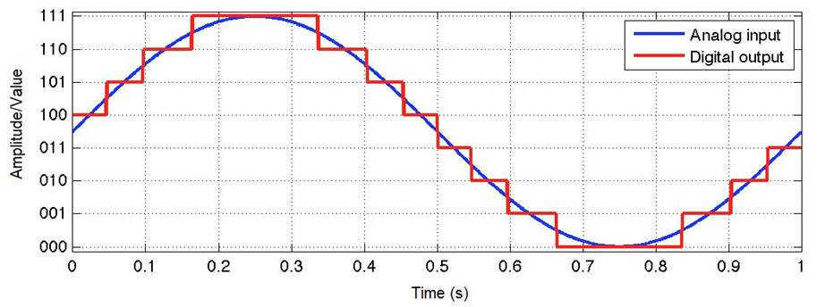
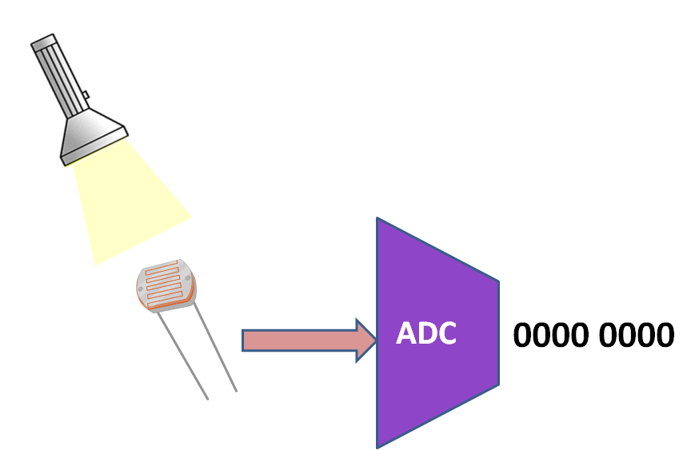
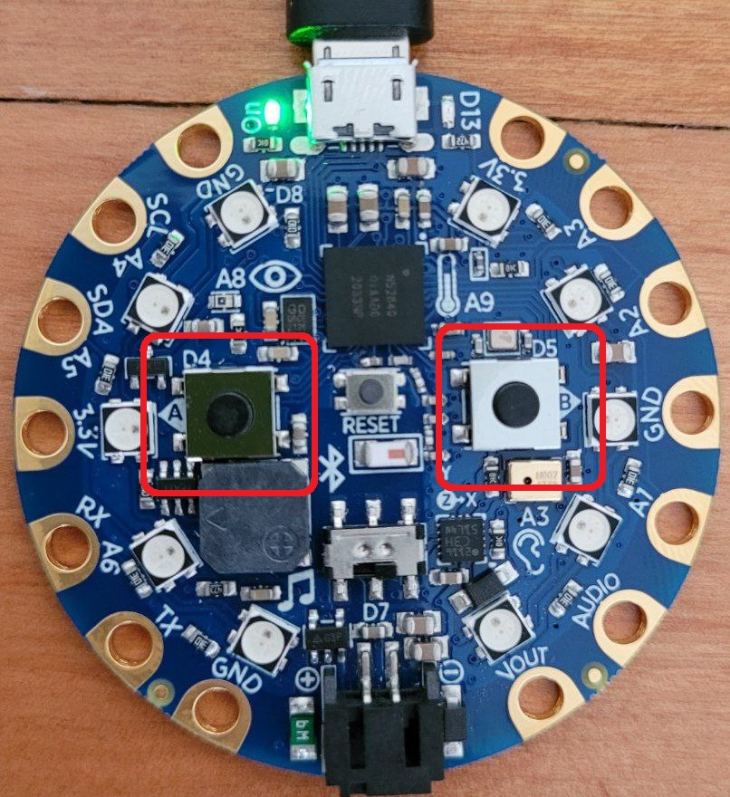
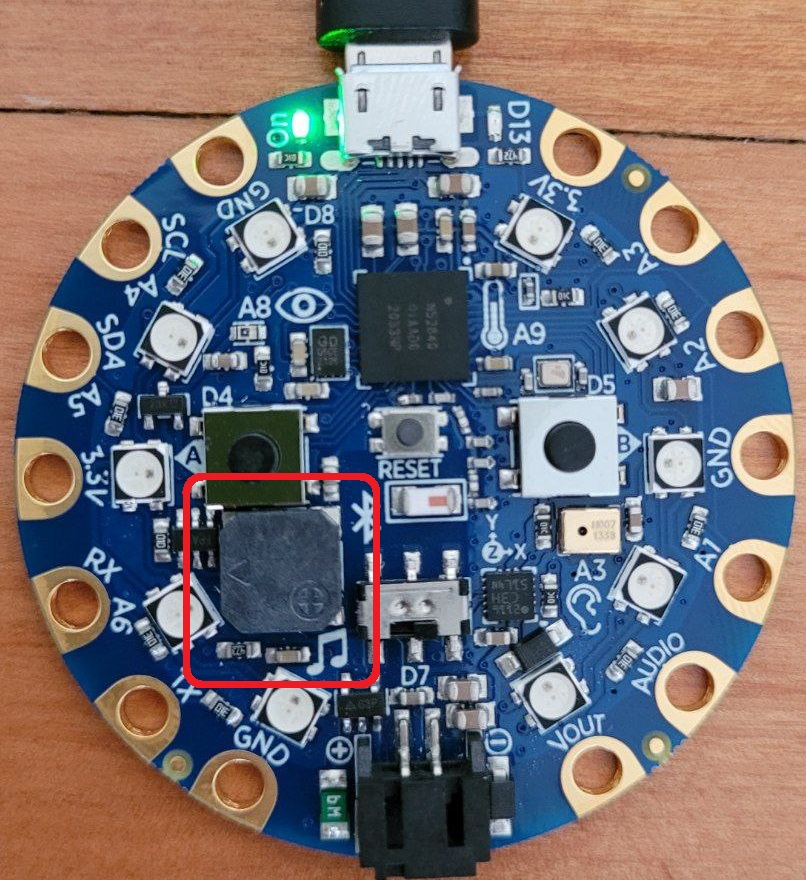
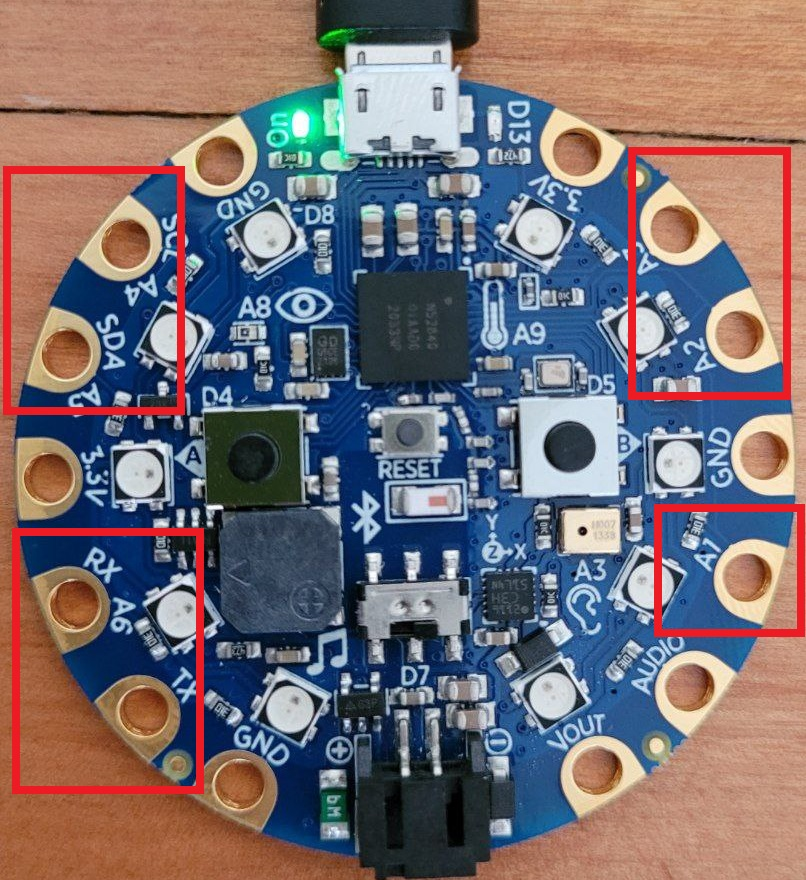
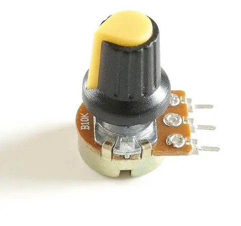
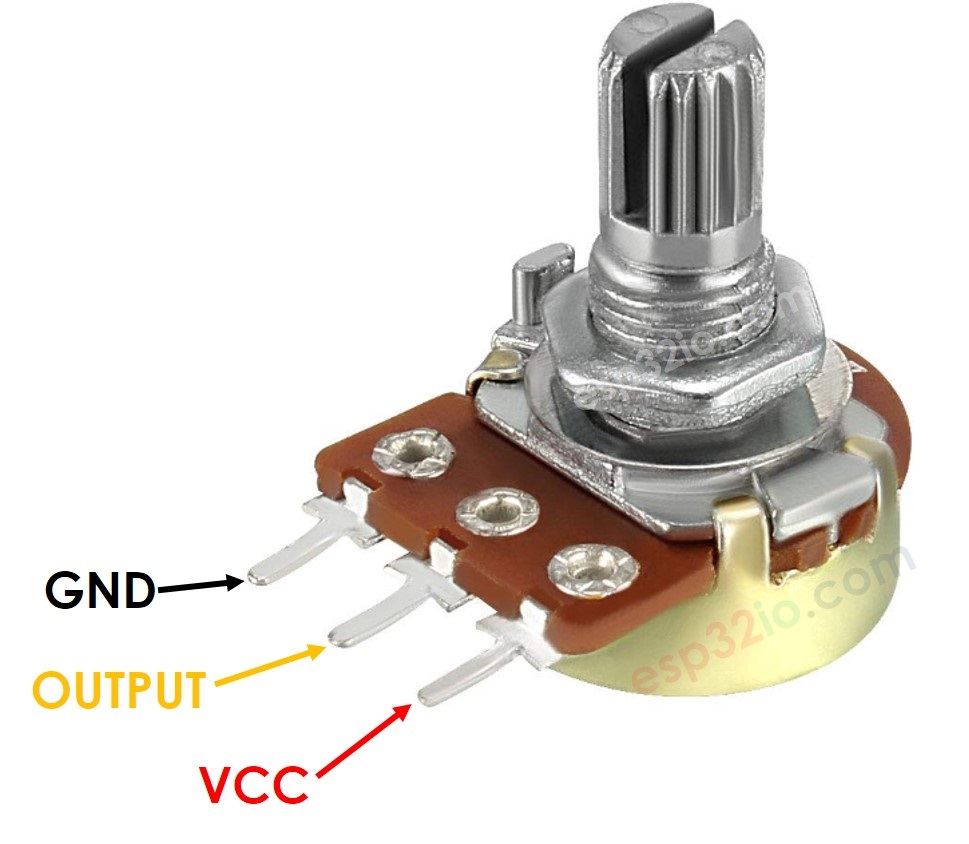
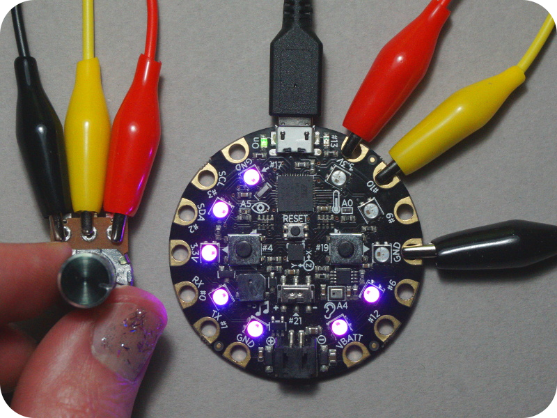

# clase-11

## introducción a los sensores

los sensores nos permiten obtener mediciones de algún fenómeno que nos interese, por ejemplo:

- el estado de un botón (apretado o suelto).
- la posición de una perilla.
- la magnitud o frecuencia de alguna fuente de sonido.
- la velocidad del viento.
- la temperatura del agua.
- la luminosidad de cierta fuente de luz.

los sensores permiten obtener información del mundo real para poder desplegarla para su simple inspección, o reaccionar a ella de algún modo, generando una acción.

### densidad de información

al tratar de medir el mundo real, los humanos han generado escalas numéricas para representar sus datos. por ejemplo, la escala de decibelios para medir el sonido, o la de grados celcius para medir temperatura.

imaginemos un termómetro que es capaz de medir cambios de temperatura de 0.1°C y otro que puede detectar cambios de 0.01°C. ¿con qué termómetro obtendré más información?

mientras más preciso es nuestro sensor, la escala numérica se hace más "densa", pudiendo almacenar más información.

### transformando la información a números digitales

actualmente lo más usual es que los datos obtenidos por sensores sean almacenados y procesados de forma digital usando computadores.

para lograr esto es necesario llevar a cabo un proceso llamado *"conversión análogo digital"* que fundamentalmente lo que hace es tomar una magnitud física y transformarla a un número de *n* bits que los computadores pueden entender.

mientras más bits, la escala será más densa y la información será más representativa de la realidad.

<p float="left" align="middle">


</p>

## sensores en circuit playground

como vimos la semana pasada, la tarjeta de desarrollo circuit playground integra varios sensores que podemos utilizar inmediatamente:

- 2x pulsadores (Botones A y B)
- 7x sensores de contacto (A1-A7)
- 1x sensor de movimiento y orientación
- 1x sensor de temperatura
- 1x sensor de luz
- 1x sensor de sonido básico

además los pines A1-A7 están conectados a un conversor análogo-digital, por lo que se pueden utilizar para medir un voltage analógico entre 0 volts y 3.3 volts.

esto permite integrar sensores externos que nos entreguen un voltaje.

## usando los botones pulsadores

<p float="left" align="middle">

</p>

los botones A y B solo pueden tener dos estados: apretados o sueltos. 

para nuestro mini computador esto se representa con un bit que puede tener el estado ```0``` (```False```) o ```1``` (```True```).

para consultar el estado de cada botón solo debemos importar el objeto ```cp``` y acceder a las propiedades ```cp.button_a``` y ```cp.button_b```.

si queremos que se ejecute alguna acción cuando alguno de los botones esté en el estado ```True```, usaremos un bloque ```if``` de python.

los bloques ```if``` se utilizan para tomar decisiones en base a una pregunta lógica.

Ejemplos de preguntas lógicas:
- ```if x >= 10:```
- ```if y < 0:```
- ```if z == 25: ```
- ```if cp.button_a == True: ```
- ```if cp.button_a == False: ```
- ```if cp.button_a != True: ```

en este caso como el botón solo puede tener el estado ```True``` o ```False```, solo tiene sentido preguntar por estos dos estados.

```python
# ejemplo 01: leyendo botones pulsadores con bloque if
from adafruit_circuitplayground import cp

RED = (255, 0, 0)
BLUE = (0, 0, 255)

cp.pixels.brightness = 0.1

while True:
    if cp.button_a == True:
        cp.pixels.fill(RED)
    
    if cp.button_b == True:
        cp.pixels.fill(BLUE)
```

## combinando los botones con el parlante para hacer sonidos

en el siguiente ejemplo utilizaremos el parlante usando las funciones ```cp.start_tone(freq)``` y ```cp.stop_tone()```.

<p float="left" align="middle">

</p>

la función ```cp.start_tone(freq)``` necesita la frecuencia del sonido que deseamos reproducir. 

antes de cambiar la frecuencia siempre es necesario ejecutar la instrucción ```cp.stop_tone()```.

también podemos usar la función ```cp.play_tone(freq, duration)``` para reproducir un tono por una duración determinada en segundos.

```python
# ejemplo 02: usando botones y parlante con bloque if, elif y else.
from adafruit_circuitplayground import cp

while True:
    if cp.button_a == True:
        cp.start_tone(400)
    elif cp.button_b == True:
        cp.start_tone(300)
    else:
        cp.stop_tone()
```

el bloque ```if``` se puede acompañar con un bloque ```elif``` y otro bloque ```else```.

el bloque ```elif``` permite ejecutar una nueva pregunta lógica si es que la anterior no resultó válida.

el bloque ```else``` se ejecuta solo si ninguna de las preguntas lógicas anteriores resultó válida.

se ejecuta solo una da las tres alternativas.

## reproduciendo archivos de audio

nuestra placa es capaz de reproducir sonidos más complejos.

como los recursos son limitados, los archivos de audio deben seguir algunas reglas específicas.

- archivos .wav
- 16-bit
- frecuencia de muestreo menor o igual a 22050 hertz
- monofónicos

Adafruit tiene una guía para poder convertir tus archivos de audio a este formato en [este link.](https://learn.adafruit.com/adafruit-wave-shield-audio-shield-for-arduino/convert-files 'convertir audio')

Por ahora haremos un ejemplo con dos audios ya adaptados, descárgalos y súbelos a tu placa:

- [laugh.wav](https://cdn-learn.adafruit.com/assets/assets/000/047/232/original/laugh.wav?1507858014 'laugh.wav')
- [rimshot.wav](https://cdn-learn.adafruit.com/assets/assets/000/047/231/original/rimshot.wav?1507858005 'rimshot.wav')

usaremos la función  ```cp.play_file(filename)``` para reproducirlos.

```python
# ejemplo 03: reproduciendo archivos .wav
from adafruit_circuitplayground import cp

while True:
    if cp.button_a:
        cp.play_file("rimshot.wav") 
    if cp.button_b:
        cp.play_file("laugh.wav")
```

## sensores de contacto capacitivos (*touch*)

<p float="left" align="middle">

</p>

las entradas A1 a A7 pueden ser utilizados como sensores capacitivos *touch*. Para eso tenemos la función ```cp.adjust_touch_threshold(100)``` que nos permite ajustar la sensibilidad de los botones *touch*. 

podemos escribir ```cp.touch_A1 ... cp.touch_A7``` para acceder al estado de cada botón, que puede ser solamente ```True``` o ```False```.

```python
# ejemplo 03: usando botones capacitivos y parlante.
from adafruit_circuitplayground import cp

cp.adjust_touch_threshold(100)
f_base = 200

while True:
    if cp.touch_A1 == True:
        cp.start_tone(f_base)
    elif cp.touch_A2 == True:
        cp.start_tone(f_base + 25)
    elif cp.touch_A3 == True:
        cp.start_tone(f_base + 25*2)
    elif cp.touch_A4 == True:
        cp.start_tone(f_base + 25*3)
    elif cp.touch_A5 == True:
        cp.start_tone(f_base + 25*4)
    elif cp.touch_A6 == True:
        cp.start_tone(f_base + 25*5)
    elif cp.touch_A7 == True:
        cp.start_tone(f_base + 25*6)
    else:
        cp.stop_tone()
```

## agregando perillas (potenciómetros)

un elemento clásico en los instrumentos electrónicos son las perillas, que permiten ajustar distintos parámetros musicales.

electrónicamente las perillas son potenciómetros (resistencias variables), que actuan como un sensor ya que informan a nuestro mini computador su estado o posición a través de un voltaje.

<p float="left" align="middle">


</p>

los potenciómetros poseen 3 pines (patitas):
 - una de ellas se conecta a 0 volts (tierra)
 - la otra se conecta a un voltaje, por ejemplo 3.3 volts
 - el pin central tendrá un voltaje variable entre 0v y 3.3v, dependiendo de la posición de la perilla.

<p float="left" align="middle">

</p>

nuestra tarjeta de desarrollo puede leer ese voltaje ya que posee un conversor análogo-digital conectado en los pines A0-A7.

esto significa que el pin central del potenciómetro lo podemos conectar a cualquiera de estas entradas.


## nn

```python
# ejemplo 00: sensor de luz

from adafruit_circuitplayground import cp
import time

while True:
    luz = cp.light
    print(luz)
    time.sleep(0.01)
```

```python
# ejemplo 00: sensor de luz y despliegue en el trazador de gráficos

from adafruit_circuitplayground import cp
import time

while True:
    luz = (cp.light,)
    print(luz)
    time.sleep(0.01)
```

```python
# ejemplo 00: sensor de luz controlando la frecuencia del parlante
from adafruit_circuitplayground import cp
import time

while True:
    luz = cp.light
    cp.play_tone(luz*1.5, 0.2)
```


```python
# ejemplo 00: graficando datos del acelerómetro
import time
from adafruit_circuitplayground import cp

while True:
    x, y, z = cp.acceleration
    print((x, y, z)) 

    time.sleep(0.1) 
```