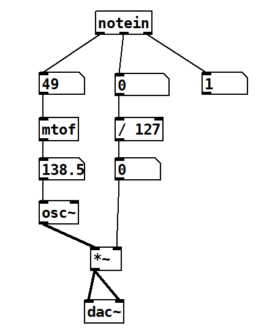
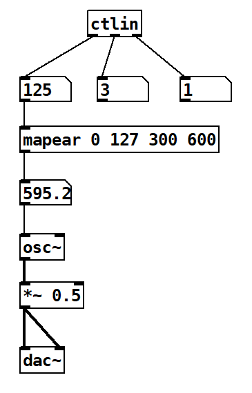

# clase-12

## integrando sensores con pure data

la tarjeta de desarrollo circuit playground se puede usar como un dispositivo MIDI capaz de enviar mensajes a quién pueda recibirlos. 

pure data es capaz de recibir mensajes MIDI sin problemas, lo que significa que podemos controlar los instrumentos que programemos en pure data a través de la información que enviemos desde nuestra tarjeta.

## enviando notas MIDI desde la tarjeta

en el siguiente ejemplo se inicializa la interfaz midi, luego se enciende una nota, y luego se apaga cada 1 segundo.

se utiliza la función `NoteOn(nota, vol)` para enviar un mensaje para encender una nota midi. Recibe una nota midi (un número de 0 a 127), y el volumen asociado a esa nota (de 0 a 127).

si una nota se cambia a volumen cero, la nota dejará de sonar.

```python
# ejemplo 1: interfaz midi básica
import time
import usb_midi
import adafruit_midi

# importar función para encender nota
from adafruit_midi.note_on import NoteOn

# inicializa puerto midi
midi = adafruit_midi.MIDI(midi_out=usb_midi.ports[1], out_channel=0)  

while True:
    LA = NoteOn(46, 30)     # nota midi 46 = LA, volumen en 30 (de 0 a 127)
    midi.send(LA)           # envia mensaje midi
    time.sleep(1)
    
    LA_OFF = NoteOn(60, 0)  # se apaga la nota poniendo volumen en 0
    midi.send(LA_OFF)       # envia mensaje midi
    time.sleep(1)
```

## recibiendo notas MIDI en pure data

para recibir la información de las notas MIDI en pure data necesitamos crear un bloque llamado `notein`.

el bloque nos entrega 3 elementos: la nota, el volumen y el puerto MIDI por el que llegó la información.

<p float="left" align="middle">

</p>

## enviando mensajes MIDI personalizados (ControlChange)

hasta ahora solo hemos visto como encender o apagar notas de nuestro instrumento.

el protocolo MIDI también permite enviar mensajes más personalizados con el objetivo de cambiar parámetros más específicos que se pueden usar, por ejemplo, para controlar efectos, ecualización, eco, envolventes, etc.

en MIDI, el envío de parámetros personalizados se le llama ControlChange.

ControlChange consta de dos datos:
- número del parámetro
- valor del parámetro

en nuestro caso, podemos usar la función `ControlChange(numero, valor)` para enviar los valores de nuestros sensores a pure data. 

la única limitante es que solo podemos enviar un valor entre 0 y 127, por lo que necesitamos utilizar la función `mapear()` para transformar la escala de nuestro sensor a la escala entre 0 y 127. 

en el siguiente ejemplo enviaremos la información del eje Z del acelerómetro a pure data utilizando la función `ControlChange(numero, valor)`

```python
# ejemplo 2: enviando datos de sensor via MIDI ControlChange
import time
import math
import usb_midi
import adafruit_midi
from adafruit_circuitplayground import cp

# importar función para encender nota
from adafruit_midi.control_change import ControlChange

# inicializa puerto midi
midi = adafruit_midi.MIDI(midi_out=usb_midi.ports[1], out_channel=0)  

# funcion para convertir escala a1-a2 a escala b1-b2
def mapear(original, a1, a2, b1, b2):
    return min(b2, max(b1, math.ceil(b1 + ((original - a1) * (b2 - b1) / (a2 - a1)))))

while True:
    # leer aceleracion en 3 dimensiones
    x, y, z = cp.acceleration

    # transforma el valor a la escala midi de 0 a 127
    z_en_escala_midi = mapear(z, -10, 10, 0, 127) 

    # enviamos mensaje
    cc_z = ControlChange(3, z_en_escala_midi)
    midi.send(cc_z)
    time.sleep(0.1)
```

## recibiendo mensajes MIDI personalizados

<p float="left" align="middle">

</p>
